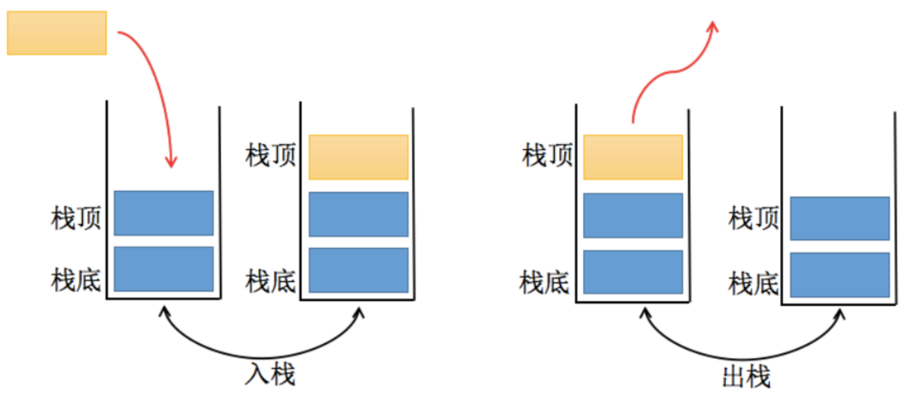

### 栈

数组是一种线性结构，可以在任意位置进行删除，插入操作，但是有时候

我们为了实现某种功能，必须对这种任意性进行限制,

栈和队列就是比较常见的受限的线性结构。

### 什么是栈

- `LIFO(last in first out)` 表示的就是后进的元素先弹出，类似于自助餐上面的盘子

- 其限制就是只允许在一端进行插入和删除操作，该端被称为栈顶，另一端则是栈底

  

  如下图所示：

  

### 程序中的栈结构

- 函数调用栈：A(B(C(D())))

  即函数A中调用B，B中调用C，C调用D。在A的执行中A会被压入栈，随后B执行B也会被压入栈，函数C和D也会被压入栈。所以当前的栈顺序为A->B->C->D(栈顶)。函数D执行之后会被弹出栈。弹出栈的顺序为D->C->B->A。

- 递归：

  为什么没有停止条件的递归会造成栈溢出？比如函数 A 为递归函数，不断地调用自己（因为函数还没有执行完，不会把函数弹出栈），不停地把相同的函数 A 压入栈，最后造成栈溢出（Queue Overfloat）。

### 栈结构实现

#### 栈常见的操作

- `push()` ：添加一个新元素到栈顶位置
- `pop()`: 移除栈顶的元素，并返回该元素
- `peek()`:返回栈顶元素(不改变栈)
- `isEmpty()`:如果栈中没有元素则返回`true`，否则返回`false`
- `size()`:返回栈长度
- `toString()`:将栈结构的内容以字符串的形式返回

#### 栈封装

```javascript
    class Stack {
      constructor() {
		  this.items = []
	  }
      //入栈
	  push(element) {
		  this.items.push(element)
	  }
      //出栈
	  pop() {
		  return this.items.pop();
	  }
      //查看栈顶
	  peek() {
		  return this.items[this.items.length - 1]
	  }
	  isEmpty() {
		  return this.items.length === 0
	  }
	  size() {
		  return this.items.length
	  }
	  toString() {
	  	let result = ''
        for(let item of this.items) {
            result +=   item + ' ' 
        }
          
        
	  }

    }

    //利用栈封装10进制转其他进制
    function hex(num, base = 2) {
        let stack = new Stack();
        let binary = '';
        while(num > 0) {
            stack.push(num % 2);
            num = Math.floor(num / 2)
        }
        while(!stack.isEmpty()) {
            binary += stack.pop()
        }
        return binary;
    }
```