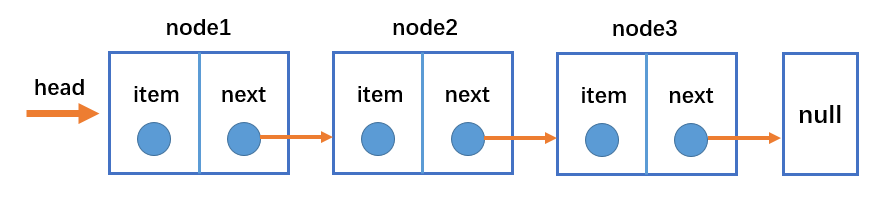
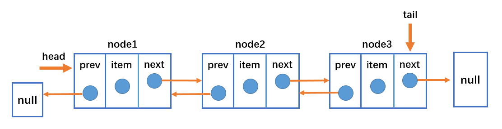

# 链表

### 认识链表

#### 链表与数组

链表与数组一样，都可以储存一系列元素，但2者的实现机制不一样。

### 数组

- 存储多个元素，数组（或列表）可能是最常用的数据结构。

- 几乎每一种编程语言都有默认实现数组结构，提供了一个便利的 `[]` 语法来访问数组元素。

- 数组缺点：

  数组的创建需要申请一段连续的内存空间(一整块内存)，并且大小是固定的，当前数组不能满足容量需求时，需要扩容。 (一般情况下是申请一个更大的数组，比如 2 倍，然后将原数组中的元素复制过去)

  在数组开头或中间位置插入数据的成本很高，需要进行大量元素的位移。

### 链表

- 储存多个元素另一个选择是使用链表

- 不同于数组，链表中的元素在内存中不必要是连续的空间。

- 链表中的元素由元素本身节点和指向下一个节点的引用

- 链表的优点：

    内存空间不必是连续的，可以充分利用计算机的内存，实现灵活的内存动态管理。

    链表不必在创建时就确定大小，并且大小可以无限延伸下去。

    链表在插入和删除数据时，时间复杂度可以达到 O(1)，相对数组效率高很多。

- 链表大的缺点:

    访问任何一个位置的元素时，需要从头开始访问。(无法跳过第一个元素访问任何一个元素)

    无法通过下标值直接访问元素，需要从头开始一个个访问，直到找到对应的元素。

    虽然可以轻松地到达下一个节点，但是回到前一个节点是很难的。

#### 单向链表

- 链表的数据结构

  `head`属性指向链表的第一个元素

  链表的最后一个节点指向`null`

  当链表中一个节点都没有的时候，`head`指向`null`

  

### 链表中常见的操作

- `append(element)`: 向链表的尾部添加一个新的项
- `insert(position, element)`:向链表中的特定位置插入一个新的项
- `get(position)`:获取对应位置的元素
- `indexOf(element)`:返回元素在链表中对应的索引，如果链表中没有此元素则返回`-1`
- `update(position, element)`:修改某个位置的元素
- `removeAt(position)`:从链表中的特定位置删除某项
- `remove(element)`:从链表中移除某项
- `isEmpty()` 如果链表中不包含任何元素，返回 trun，如果链表长度大于 0 则返回 false。
- `size()` 返回链表包含的元素个数，与数组的 length 属性类似。
- `toString()` 由于链表项使用了 Node 类，就需要重写继承自 JavaScript 对象默认的 toString 方法，让其只输出元素的值。

```javascript
    class Element {
		constructor(element) {
			this.element = element;
			this.next = null

		}
	}

	class Link {
		constructor() {
			this.head = null;
			this.length = 0
		}
		append(element) {
			if (element === undefined) return;
			let newNode = new Element(element);
			if(!this.head) {
				this.head = newNode;
			}else {
				let current = this.head;
				while(current.next) {
					current = current.next;
				}
				current.next = newNode
			}
			this.length++;
		}
		//指定位置插入
		insert(element, position){
			//越界判断
			if(position < 0 || this.length < position) return false
			let current = this.head;
			let newNode = new Element(element)
			if(position === 0) {
				this.head = newNode;
				newNode.next = current
			}else {
				let index = 0;
				let prev = null;
				while(index++ < position) {
					prev = current;
					current = current.next;
				
				}
				prev.next = newNode;
				newNode.next = current;
			}
			this.length++
			return true
		}
		get(position) {
			if(position < 0 || position > this.length - 1) return -1;
			let index = 0;
			let current = this.head;
			while(index++ < position) {
				current = current.next;
			}
			return current.element;
		}
		indexOf(element) {
			let index = 0;
			let current = this.head;
			while(current) {
				if(current.element === element) {
					return index;
				}
				current = current.next;
				index++
			}
			return -1
		}
		removeAt(position) {
			if(position < 0 || position > this.length - 1) return null;
			let index = 0;
			let current = this.head;
			let prev = null;
			while(index++ < position) {
				prev = current;
				current = current.next
			}
			prev.next = current.next;
			this.length--;
			return current.element;
		}
		update(position, element) {
			if(position < 0 || position > this.length - 1) return null;
			let removeElement = this.removeAt(position);
			this.insert(element, position)
			return removeElement;
		}
		remove(element) {
			let index = this.indexOf(element)
			if(index === -1) return 
			this.removeAt(index)
		}
		isEmpty() {
			return this.length === 0
		}
		size() {
			return this.length
		}
		toString() {
            let currentNode = this.head;
            let result = ''
            while(currentNode) {
                result += currentNode.element + ' '
                currentNode = currentNode.next
            }

            return result
        }
	}
```

#### 双向链表

##### 单向链表与双向链表

###### 单向链表

- 只能从头遍历到尾部,或从尾遍历到头
- 链表相连的过程是单向的，实现原理是上一个节点中有指向下一个节点的引用。
- 单向链表有一个比较明显的缺点：可以轻松到达下一个节点，但回到前一个节点很难，在实际开发中, 经常会遇到需要回到上一个节点的情况。

###### 双向链表

- 既可以从头遍历到尾，也可以从尾遍历到头。
- 链表相连的过程是双向的。实现原理是一个节点既有向前连接的引用，也有一个向后连接的引用。
- 双向链表可以有效的解决单向链表存在的问题。
- 双向链表缺点：
  - 每次在插入或删除某个节点时，都需要处理四个引用，而不是两个，实现起来会困难些。
  - 相对于单向链表，所占内存空间更大一些。
  - 但是，相对于双向链表的便利性而言，这些缺点微不足道。

##### 双向链表结构



- 双向链表不仅有 head 指针指向第一个节点，而且有 tail 指针指向最后一个节点。
- 每一个节点由三部分组成：item 储存数据、prev 指向前一个节点、next 指向后一个节点。
- 双向链表的第一个节点的 prev 指向 null。
- 双向链表的最后一个节点的 next 指向 null。

##### 双向链表常见的操作

- `append(element)`: 向链表尾部追加一个元素。
- `insert(position, element)`: 向链表中的指定位置插入一个新元素。
- `removeAt(position)`: 移除链表中指定位置的元素。
- `get(position)`: 获取链表指定位置的元素。
- `indexOf(element)`: 返回元素在链表中的索引。如果链表中没有该元素就返回`-1`。
- `update(position, element)`:  修改指定位置上的元素。
- `remove(element)`: 从链表删除指定的元素。
- `isEmpty()`: 如果链表中不包含任何元素，返回 `trun`，如果链表长度大于 0 则返回 `false`。
- `size()`: 返回链表中元素个数。
- `toString()`: 将链表元素以字符串的形式返回
- `forwardString()` 返回正向遍历节点字符串形式。
- `backwordString()` 返回反向遍历的节点的字符串形式。

###### 封装双向链表

```javascript
	//双向链表
	class DoubleElement extends Element{
		constructor(element) {
			super(element)
            //指向上一个节点
			this.prev = null;
		}
	}

	class DoubleLink extends Link {
		constructor() {
			super()
            //指向末尾的节点
			this.tail = null;
		}
		append(element) {
			if (element === undefined) return;
			const doubleElement = new DoubleElement(element)
			//原来没有数据
			if(this.head === null) {
				this.tail = doubleElement;
				this.head = doubleElement;
			}else {
				this.tail.next = doubleElement;
				doubleElement.prev = this.tail;
				this.tail = doubleElement;
			}
			this.length++;
		}
		insert(element, position) {
            //这里的postition > this.length或position > this.length - 1 
            /根据自己来设计
			if(position < 0 || position > this.length) return
			const doubleElement = new DoubleElement(element);
			//头部插入
			if(position === 0) {
				doubleElement.next = this.head;
				this.head.prev = doubleElement;
				this.head = doubleElement;
			//尾部插入
			}else if(position === this.length) {
				this.tail.next = doubleElement
				doubleElement.prev = this.tail
				this.tail = doubleElement
			}else {
				let index = 0;
				let current = this.head;
				let prev = null;
				while(index++ < position) {
					prev = current;
					current = current.next
				} 
				prev.next = doubleElement
				doubleElement.prev = prev;
				doubleElement.next = current
				current.prev = doubleElement;
			}
			this.length++
		}
		removeAt(position) {
			if(position < 0 || position > this.length - 1) return null
			let current = this.head;
			if(position === 0) {
				if(this.length === 1) {
					this.head = null
					this.tail = null
				}else {
					this.head = this.head.next;
					this.head.prev = null;
				}
				
			}else if(position === this.length - 1) {
				current = this.tail
				this.tail.prev.next = null;
				this.tail = this.tail.prev;
			}else {
				let index = 0;
				let prev = null;
				
				while(index ++ < position) {
					prev = current;
					current = current.next;
				}
				prev.next = current.next;
				current.next.prev = prev;

			}
			this.length--
			return current.element
		}
        forwardToString() {
            let result = ''
            let currentNode = this.head
            while(currentNode) {
                result += currentNode.element + ' '
                currentNode = currentNode.next;
            }
            return result
        }
    	backwardString() {
            let result = ''
            let currentNode = this.tail
            while(currentNode) {
                result += currentNode.element + ' '
                currentNode = currentNode.prev;
            }
            return result
        }
        //...其他继承至Link
	}
```