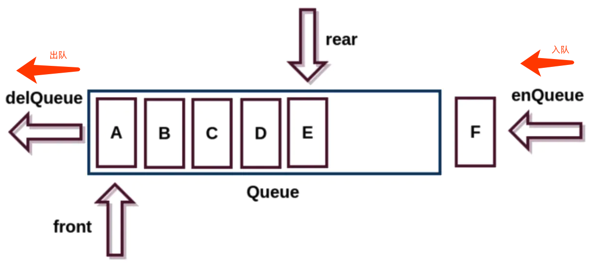

## 队列

队列(Queue)是一种受限的数据结构，特点：先进先出（FIFO:First In First Out）

**受限之处:**

- 只允许在表的前端进行删除操作

- 只允许在表的尾端进行插入操作

  

#### 队列中常见的操作

- `enqueue(element)`:向队列队尾添加一个或多个元素
- `dequeue()`: 移除队列中第一个元素，并返回该元素。
- `front()`: 返回队列中第一个元素，不改变队列
- `isEmpty()`: 如果队列中不包含元素返回`true`,否则返回`false`
- `size()`： 返回队列中元素的个数
- `toString()`： 将队列中的元素通过字符串形式返回

#### 队列封装(先进先出)

```javascript
    class Queue() {
            constructor() {
			    this.items = [];
            }
            //入列
            enqueue(element) {
                this.items.push(element)
            }
            //出列
            dequeue() {
                return this.items.shift()
            }
            front() {
                if(this.isEmpty()) return null
                return this.items[0]
            }
            isEmpty() {
                return this.items.length === 0
            }
            size() {
                return this.items.length
            }
        toString() {
            let result = ''
            for(let item of this.items){
                result += item + ' '
            }
            return result
        }
    }
```

#### 队列的应用

使用队列实现小游戏：**击鼓传花**。

分析：传入一组数据集合和设定的数字 number，循环遍历数组内元素，遍历到的元素为指定数字 number 时将该元素删除，直至数组剩下一个元素。

```javascript
//击鼓传花(队列应用)
function passGame(nameList, num) {
	let queue = new Queue();

	for(let i = 0; i < nameList.length; i++) {
		queue.enqueue(nameList[i])
	}

	while(queue.size() > 1) {
		for(let i = 0; i < num - 1; i++) {
			queue.enqueue(queue.dequeue())
		}
		queue.dequeue()
	}

	return queue.front()
}
```

#### 优先队列

```javascript
    //优先级队列
    class QueueElement {
		constructor(element, priority) {
			this.element = element;
			this.priority = priority;
		}
	}

	class PriorityQueue extends Queue{
        constructor() {
            super()
        }
		enqueue(element, priority) {
			const queueElement = new QueueElement(element, priority);
			if(this.isEmpty()) {
				this.items.push(queueElement)
			}else {
				let isAdd = false;
				for(let i = 0; i < this.items.length; i++) {
					if(this.items[i].priority > priority) {
						this.items.splice(i, 0, queueElement)
						isAdd = true
						break; //必须跳转循环 ，不然会造成死循环
					}
				}
				//未找到时插入
				if(!isAdd) {
					this.items.push(queueElement)
				}
			}
		}
        ...j
	}
```