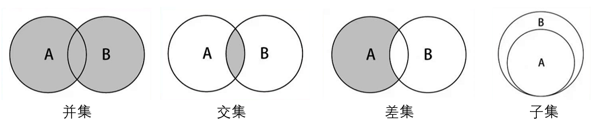

## 集合

几乎每种编程语言中，都有集合结构。集合比较常见的实现方式是哈希表，这里使用 JavaScript 的 Object 进行封装。

### 集合特点

- 集合通常是由一组**无序的**、**不能重复的**元素构成。
- 数学中常指的集合中的元素是可以重复的，但是计算机中集合的元素不能重复。
- 集合是特殊的数组。
  - 特殊之处在于里面的元素没有顺序，也不能重复。
  - 没有顺序意味着不能通过下标值进行访问，不能重复意味着相同的对象在集合中只会存在一份。

### 集合常见的操作

- `add(value)`: 向集合添加一个新的项。
- `remove(value)`: 删除集合中某一项。
- `has(value)`: 判断集合中是否包括该项。
- `size()`: 返回集合的项的个数.
- `clear()`: 清空集合。
- `values()`: 返回一个包含集合中所有值的数组。

### 代码实现

```javascript
class Set {
    constructor() {
        this.items = {};
    }

    add(value) {
        if(this.has(value)) return false

        this.items[value] = value

        return true;
    }

    remove(value) {
        if(!this.has(value)) return false

        delete this.items[value]

        return true
    }

    size() {
        return Object.keys(this.items).length
    }

    clear() {
        this.items = {}
    }

    values() {
        return Object.keys(this.items)
    }

    has(value) {
        return this.items.hasOwnProperty(value)
    }
}
```

### 集合间的操作

- **并集**：对于给定的两个集合，返回一个包含两个集合中所有元素的新集合。
- **交集**: 对于给定的两个集合,返回一个包含两个集合共同元素的新集合。
- **差集**: 对于给定的两个集合，返回一个包含所有存在于第一个集合且不存在于第二个集合的元素的新集合。
- **子集**: 验证一个给定集合是否是另一个集合的子集。



### 代码实现

```javascript
	//并集
    union(otherSet) {
        let unionSet = new Set();
        let values = this.values();
        for(let i = 0, l = values.length; i < l; i++) {
            unionSet.add(values[i])
        }

        values = otherSet.values()
        for(let i = 0, l = values.length; i < l; i++) {
            unionSet.add(values[i])
        }

        return unionSet;
    }

    //交集
    intersection(otherSet) {
        let intersectionSet = new Set();
        let values = this.values();
        for(let i = 0, l = values.length; i < l; i++) {
            if(otherSet.has(values[i])) {
                intersectionSet.add(values[i])
            }
        }
        return intersectionSet
    }

    //差集
    difference(otherSet) {
        let differenceSet = new Set();
		/从当前集合中取出每一个 value，判断是否在 otherSet 集合中存在，不存在的即为差集
        let values = this.values();
        for(let i = 0, l = values.length; i < l; i++) {
            if(!otherSet.has(values[i])) {
                differenceSet.add(values[i])
            }
        }
        return differenceSet
    }

    //子集
    subset(otherSet) {
        let values = this.values();
        // 从当前集合中取出每一个 value，判断是否在 otherSet 集合中存在，有不存在的返回 false
        for(let i = 0, l = values.length; i < l; i++) {
            if(!otherSet.has(values[i])) {
                return false
            }
        }
        return true
    }
```

